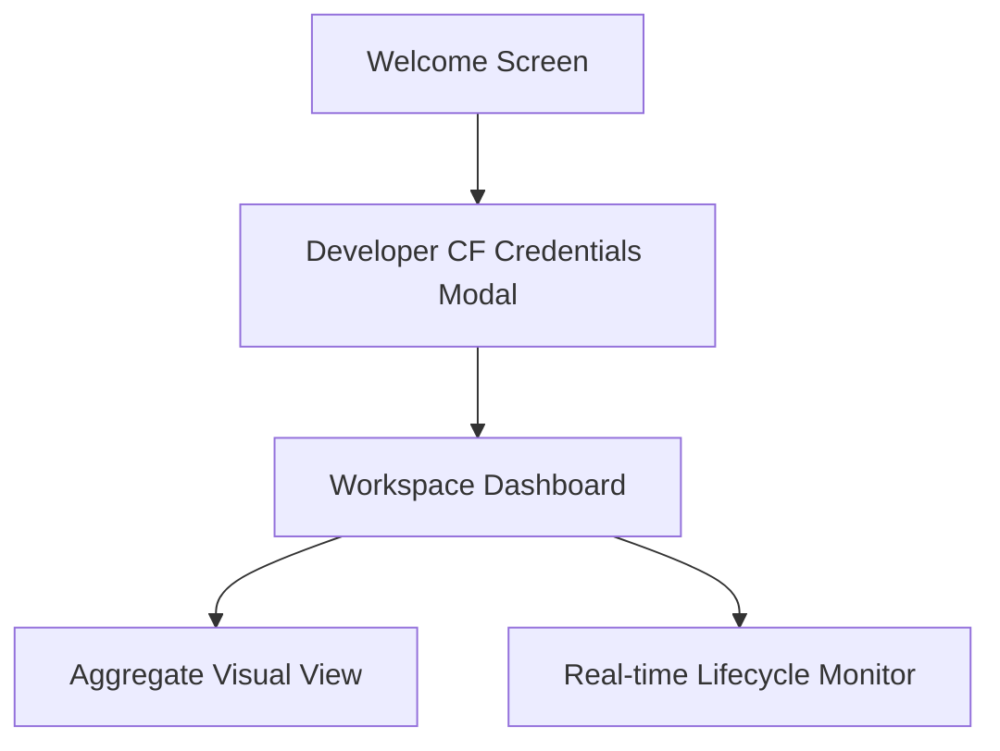

# Phase 1: UI/UX & Visuals/Animations Design

This phase covers the visual design system, layout, and animation guidelines for the **Lacify Runtime v1** web application. The goal is to make the application feel like a premium, living dashboard rather than a standard developer tool.

## 1. Visual Aesthetics & Design System

### Color Palette & Theme (Dark Mode First)
- **Primary Background**: HSL(222, 47%, 11%) — Sleek deep obsidian.
- **Glass Card Background**: HSL(222, 47%, 16%, 0.6) with `backdrop-filter: blur(16px)` and border `1px solid rgba(255, 255, 255, 0.08)`.
- **Accent - Active/Wake**: HSL(190, 90%, 50%) — Electric cyan.
- **Accent - Success/Persist**: HSL(145, 80%, 45%) — Vibrant emerald.
- **Accent - Warning/Validate**: HSL(35, 90%, 55%) — Warm amber.
- **Accent - Sleep/Inactive**: HSL(225, 15%, 50%) — Muted steel gray.

### Typography
- Use **Outfit** or **Inter** (via Google Fonts) for clean, modern sans-serif readability.
- Headlines should use light tracking and slightly heavier weights (e.g., Font Weight 600).

---

## 2. Micro-Animations & Interactions

### The Lifecycle Orb
Instead of showing text logs like `[Worker] Waking up... [Durable Object] SQL Executed`, the UI features a glowing **Lifecycle Orb** that changes state:
1. **Sleep State**: Slow pulsing, semi-transparent grey-blue glow.
2. **Wake State**: Quick transition to bright Cyan with a circular ripple effect outward.
3. **Validate State**: A quick amber pulse spinning around the orb.
4. **Execute & Persist**: A bright emerald flash flowing down into a mini database icon.
5. **Sleep State**: A smooth fade out/cool-down transition.

### Hover & Active Effects
- **Aggregate Cards** (e.g., POS, CRM, ERP): Lift on hover (+translateY), subtle glow border, and soft inner shadow transition.
- **Input Fields**: Focus state transitions the border color smoothly from muted grey to Electric Cyan, with a soft outer glow.

---

## 3. Screen Structure



### Screen A: Welcome & Credentials Portal
- Non-technical intro banner.
- A "Plug & Play" card: "Connect your Cloudflare Workspace".
- Form fields:
  - **Account ID**
  - **API Token**
- Interactive "Connect" button that animates a loading pulse to verify credentials.

### Screen B: Workspace Dashboard
- **Environment Switcher**: A segmented control/tabs to toggle between **Dev**, **Staging**, and **Production** environments, color-coded:
  - Dev: Light Blue
  - Staging: Amber
  - Production: Emerald
- High-level health cards: Active Aggregates, Database Stats, R2 Storage Used (filtered by selected environment).
- Simple toggles to turn services on/off.


---

## 4. UI Implementation References (HTML/CSS Draft)

### Card Glassmorphism Class
```css
.glass-card {
  background: rgba(24, 28, 41, 0.6);
  backdrop-filter: blur(12px);
  border: 1px solid rgba(255, 255, 255, 0.08);
  border-radius: 16px;
  box-shadow: 0 8px 32px 0 rgba(0, 0, 0, 0.3);
  transition: all 0.3s cubic-bezier(0.25, 0.8, 0.25, 1);
}
.glass-card:hover {
  transform: translateY(-4px);
  border-color: hsla(190, 90%, 50%, 0.4);
  box-shadow: 0 12px 40px 0 rgba(0, 229, 255, 0.15);
}
```

### Lifecycle Pulse Animation
```css
@keyframes pulseGlow {
  0% { transform: scale(1); box-shadow: 0 0 10px rgba(0, 229, 255, 0.2); }
  50% { transform: scale(1.05); box-shadow: 0 0 25px rgba(0, 229, 255, 0.6); }
  100% { transform: scale(1); box-shadow: 0 0 10px rgba(0, 229, 255, 0.2); }
}
.active-orb {
  animation: pulseGlow 2s infinite ease-in-out;
}
```

---

## 5. Universe View (Obsidian Graph Layout)
The **Universe View** features a 2D interactive network graph on an HTML5 Canvas:
- **Gateway Node**: Entrypoint where incoming client calls first hit.
- **Durable Object (SQLite) Nodes**: Orbiting child nodes representing deployed aggregates. They feature inner database rings to indicate local storage.
- **R2 Storage Node**: Linked to active aggregates for files/asset sync.
- **Interactive Animations**:
  - Floating drift brownian physics for organic movement.
  - Glowing transaction pulses that slide from the Gateway to DO nodes upon requests, lighting up the active targets.

